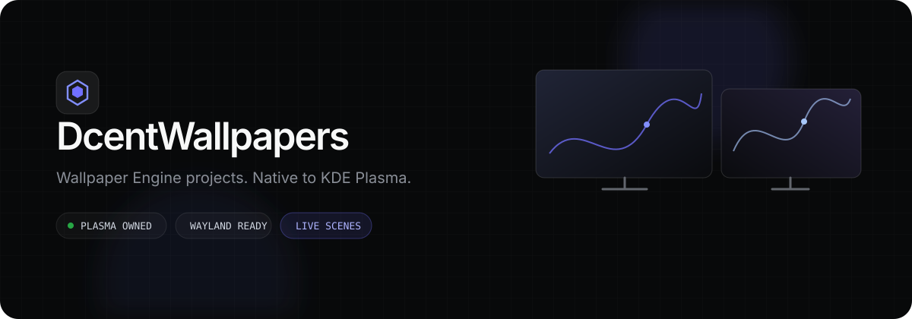

<div align="center">
  

  <br>

  [](https://github.com/dcenhance/dcent-wallpaper-linux/actions/workflows/ci.yml)
  [](https://dcenhance.github.io/dcent-wallpaper-linux/)
  [](https://kde.org/plasma-desktop/)
  [](https://wayland.freedesktop.org/)
  [](LICENSE)

  **Run local Wallpaper Engine projects as real KDE Plasma wallpapers—without covering the desktop with an overlay window.**

  [Website](https://dcenhance.github.io/dcent-wallpaper-linux/) · [Release v0.2.0](https://github.com/dcenhance/dcent-wallpaper-linux/releases/tag/v0.2.0) · [Issues](https://github.com/dcenhance/dcent-wallpaper-linux/issues)
</div>

---

## At a glance

| | |
|---|---|
| **What it is** | A `Plasma/Wallpaper` provider for KDE Plasma 6 |
| **Primary target** | Fedora/Nobara KDE on Wayland |
| **Content** | Native scenes, web projects, video, animated images, still images |
| **Rendering** | Plasma-owned QML; CaptSilver native scene module; no persistent overlay |
| **Audio** | PipeWire/PulseAudio monitor → 64 left + 64 right spectrum bands |
| **Safety** | Isolated scene preflight, cached fallback, first-frame handoff |
| **License** | GPL-2.0-only; see [upstream provenance](#license-and-provenance) |

## Contents

- [What it solves](#what-it-solves)
- [Features](#features)
- [Install](#install)
- [First run](#first-run)
- [Configure](#configure)
- [How it works](#how-it-works)
- [Compatibility](#compatibility)
- [Troubleshooting](#troubleshooting)
- [Development](#development)
- [Contributing](#contributing)
- [Security](#security)
- [License and provenance](#license-and-provenance)

## What it solves

Wallpaper Engine projects are designed for Windows. DcentWallpapers adapts their local Workshop content to the KDE Plasma wallpaper lifecycle instead of launching a second desktop-sized renderer.

That distinction matters:

- Plasma remains the owner of the wallpaper.
- KDE controls screen placement and lifecycle.
- Applying a wallpaper does not create a floating window over the desktop.
- A broken scene does not get to crash the normal Apply path before preflight.
- A slow replacement does not intentionally expose an empty frame.

> [!IMPORTANT]
> The primary supported environment is KDE Plasma 6. This is not a universal Linux desktop plugin: Hyprland and GNOME cannot load Plasma wallpaper packages. See [Compatibility](#compatibility).

## Features

- **Native scenes:** animated particles, effects, scene scripts, video textures, project properties, and audio response through CaptSilver `SceneViewer`.
- **Web projects:** Qt WebEngine, Wallpaper Engine properties, directory callbacks, clickable controls, and audio listeners.
- **Video and images:** MPV/Qt Multimedia video, animated images, and static-image fallback paths.
- **Per-wallpaper properties:** colors, booleans, sliders, text, combos, presets, conditions, and bundled asset choices.
- **Multi-screen layouts:** one output, mirrored complete wallpaper, or a synchronized spanned canvas.
- **Reliable Apply:** repeatable Apply, selection-owned double-click, accessibility activation, and KDE output-name recovery.
- **No-flicker switching:** the current backend remains visible until the replacement emits its first valid frame.
- **Local-first operation:** installed Workshop projects work without opening Steam or sending credentials to this project.

## Install

### Requirements

- KDE Plasma 6 on Wayland or X11
- Qt 6 with Qt WebEngine
- Python 3
- Vulkan-capable graphics driver for native scenes
- PipeWire with PulseAudio compatibility for system-audio reactivity
- A local Wallpaper Engine installation/library
- The maintained [CaptSilver Wallpaper Engine KDE module](https://github.com/CaptSilver/wallpaper-engine-kde-plugin)

The tested setup is Fedora/Nobara KDE with NVIDIA graphics. Mesa AMD/Intel is expected to work when Vulkan and Qt 6 are available, but needs broader hardware testing.

### 1. Build the native CaptSilver module

Install the Fedora/Nobara build dependencies:

```bash
sudo dnf install -y \
  cmake ninja-build gcc-c++ git \
  kf6-kconfig-devel kf6-knotifications-devel kf6-kcrash-devel \
  kf6-ki18n-devel kf6-kcoreaddons-devel kf6-kglobalaccel-devel \
  kf6-kxmlgui-devel plasma-activities-devel \
  qt6-qtwebengine-devel qt6-qtwebchannel-devel \
  pulseaudio-libs-devel libglvnd-devel mesa-libgbm-devel \
  lz4-devel mpv-devel freetype-devel fontconfig-devel
```

Build CaptSilver with all nested dependencies:

```bash
git clone https://github.com/CaptSilver/wallpaper-engine-kde-plugin.git
cd wallpaper-engine-kde-plugin
git submodule update --init --recursive --depth 1
```

Before building, remove the upstream process-wide `--disable-web-security` mutation from `src/plugin.cpp`. Keep this narrower local-read setting:

```cpp
qputenv("QML_XHR_ALLOW_FILE_READ", "1");
```

Then build and install:

```bash
CC=gcc CXX=g++ cmake -S . -B build -G Ninja \
  -DCMAKE_BUILD_TYPE=Release \
  -DCMAKE_INSTALL_PREFIX=/usr \
  -DUSE_PLASMAPKG=ON
cmake --build build --parallel 4
sudo cmake --install build
```

The module should be installed at:

```text
/usr/lib64/qt6/qml/com/github/captsilver/wallpaperEngineKde/
```

### 2. Build the isolated scene preflight helper

From this repository:

```bash
g++ -std=c++17 -O2 tools/scene_preflight.cpp \
  -o tools/dcent-scene-preflight \
  $(pkg-config --cflags --libs Qt6Gui Qt6Qml Qt6Quick)
install -m 0755 tools/dcent-scene-preflight \
  plasma-plugin/contents/tools/dcent-scene-preflight
```

The helper is intentionally built locally and is excluded from Git because it is platform-specific. The source is `tools/scene_preflight.cpp`.

### 3. Install the Plasma package

```bash
kpackagetool6 --type Plasma/Wallpaper --install ./plasma-plugin
systemctl --user restart plasma-plasmashell.service
systemctl --user is-active plasma-plasmashell.service
```

For later source updates, use `--upgrade` instead of `--install`.

## First run

1. Open **System Settings → Wallpaper**.
2. Select **DcentWallpapers**.
3. Set the Steam library containing `steamapps`.
4. Select a local Workshop project.
5. Press **Apply**, or double-click the project card.

Expected layout:

```text
<SteamLibrary>/
├── steamapps/common/wallpaper_engine/assets/
└── steamapps/workshop/content/431960/<WorkshopId>/
```

The plugin does not download authenticated Workshop projects. Already-installed local projects are indexed directly from disk.

## Configure

Dcent uses one Configure page with two distinct areas:

### Wallpaper settings

These come from the selected project's `project.json` and are stored per Workshop ID. File, directory, and scene-texture properties discover compatible assets inside that wallpaper's own source roots.

Preview images are gallery metadata only. They are never written to `WallpaperSource`, `MediaPath`, or another runtime source field.

### DcentWallpapers settings

These apply to provider behavior:

- **Multiple screens:** span or mirror
- **Scaling:** fill, fit, or stretch
- **FPS, volume, and mute**
- **System audio reactivity**
- **Interactive wallpaper mode**
- **Pause and power behavior**

Wallpaper Engine project properties and general provider settings remain separate.

## How it works

```text
local Workshop project
        │
        ▼
process-isolated scene preflight
        │
        ├─ valid first frame ─► native SceneViewer inside Plasma
        │
        └─ rejected/crashed ──► validated cached video or still
                                      │
                                      └─ no safe result: keep current wallpaper
```

### Backend routing

| Project type | Runtime backend |
|---|---|
| Image | `backend/Image.qml` |
| Video | MPV or `backend/QtMultimedia.qml` |
| Web | `backend/QtWebView.qml` |
| Safe scene | `backend/Scene.qml` with CaptSilver `SceneViewer` |
| Unsafe scene | Validated cached fallback, never a preview thumbnail |

### First-frame handoff

When switching wallpapers, Dcent stages the candidate backend separately. The current backend stays alive until the candidate emits `sig_backendFirstFrame`. Only then is the old backend retired. A bounded timeout prevents a broken candidate from living forever.

### Audio pipeline

```text
PipeWire/PulseAudio monitor
        → shared stereo capture
        → overlapping FFT
        → 64 left + 64 right normalized values
        ├─ native SceneViewer effects/scripts
        └─ web wallpaper audio listener
```

System-audio capture is separate from wallpaper-owned mute. A project must implement audio-reactive effects or `wallpaperRegisterAudioListener()` to visibly respond.

## Compatibility

| Environment | Status |
|---|---|
| KDE Plasma 6 + Wayland | **Supported / tested** |
| KDE Plasma 6 + X11 | **Best effort** |
| Fedora/Nobara KDE | **Supported / tested** |
| NVIDIA Vulkan | **Supported / tested** with RTX 4070 Ti |
| Mesa AMD/Intel | **Expected**, broader testing needed |
| Hyprland | **Not supported by this plugin**; requires a separate layer-shell backend |
| GNOME | **Not supported by this plugin** |
| Plasma 5 | **Not supported** |
| Login manager | Still preview only; live processing is disabled |

Wallpaper compatibility also varies by project. Windows-only APIs, unsupported shaders, missing assets, unusual codecs, and project scripts can prevent an individual wallpaper from working.

## Troubleshooting

### DcentWallpapers is missing

```bash
kpackagetool6 --type Plasma/Wallpaper --show org.dcentwallpapers.plasma
kpackagetool6 --type Plasma/Wallpaper --upgrade ./plasma-plugin
systemctl --user restart plasma-plasmashell.service
```

### Native module is missing

```bash
qmlplugindump-qt6 com.github.captsilver.wallpaperEngineKde 1.2 >/dev/null
```

If this fails, rebuild and install the CaptSilver module, then restart Plasma.

### A scene does not load

```bash
./plasma-plugin/contents/tools/dcent-scene-preflight \
  /path/to/workshop/item/scene.json \
  /path/to/wallpaper_engine/assets
```

Exit `0` means the isolated helper completed. A crash, timeout, or non-zero exit selects a cached fallback. Never bypass preflight by manually writing a scene path into Plasma configuration.

### Audio does not react

Enable **System audio reactivity**, play audio through the current default output, and inspect:

```bash
pactl get-default-sink
pactl list short sources
journalctl --user -u plasma-plasmashell.service -f
```

Look for `AudioCapture: active on monitor` and `Audio spectrum`.

### Clicks do not reach the wallpaper

Enable **Interactive wallpaper mode**. Input forwarding is disabled by default so normal desktop behavior remains available.

### Apply targets the wrong display or only works once

Install the current package. Dcent caches KDE's stable output name and falls back to the normal KCM Apply lifecycle when the transient `QScreen` identity cannot be recovered.

### Switching flickers

The active backend should remain present until the candidate emits its first-frame signal. Check the Plasma journal for the backend that fails to report a first frame.

### Plasma crashes or restarts

Check:

```bash
systemctl --user status plasma-plasmashell.service
journalctl --user -u plasma-plasmashell.service --since "10 minutes ago" --no-pager
```

Run the scene through isolated preflight before reapplying it. A later native graphics-driver fault can still affect an in-process renderer after a successful preflight.

## Development

### Tests

```bash
uv run --with pytest pytest -q \
  tests/test_multiscreen.py \
  tests/test_properties.py \
  tests/test_workshop.py
```

```bash
QML_XHR_ALLOW_FILE_READ=1 \
QT_QPA_PLATFORM=offscreen \
QT_QUICK_BACKEND=software \
/usr/lib64/qt6/bin/qmltestrunner -input "$PWD/tests/qml" -o -,txt
```

### Lint

```bash
qmllint-qt6 \
  plasma-plugin/contents/ui/config.qml \
  plasma-plugin/contents/ui/main.qml \
  plasma-plugin/contents/ui/Common.qml \
  plasma-plugin/contents/ui/Pyext.qml \
  plasma-plugin/contents/ui/backend/QtWebView.qml \
  plasma-plugin/contents/ui/backend/QtMultimedia.qml \
  plasma-plugin/contents/ui/backend/Scene.qml
```

Verified baseline for `v0.2.0`:

```text
Python tests             52 passed
QML tests                64 passed
Native audio smoke test  3 passed
QML lint                 exit 0
```

### Repository layout

```text
plasma-plugin/contents/ui/main.qml          Plasma runtime and backend handoff
plasma-plugin/contents/ui/config.qml        Configure page and Apply flow
plasma-plugin/contents/pyext.py              Catalog, RPC, preflight, and fallbacks
plasma-plugin/contents/ui/backend/Scene.qml Native scene wrapper
plasma-plugin/contents/ui/backend/QtWebView.qml Web runtime and audio bridge
tools/scene_preflight.cpp                   Isolated helper source
tests/                                      Python and QML regression tests
site/index.html                             GitHub Pages project site
```

## Contributing

1. Search existing issues and pull requests.
2. Keep Plasma as the wallpaper owner.
3. Preserve the preview/runtime source boundary.
4. Do not bypass scene preflight.
5. Add a regression test for behavior changes.
6. Test Plasma-facing changes on the relevant Wayland/X11, GPU, output, and wallpaper type.
7. Do not commit credentials, local catalog data, generated binaries, or Workshop content.

Use focused imperative commit subjects, for example:

```text
Fix first-frame handoff for scene backends
Document PipeWire spectrum routing
```

## Security

Report vulnerabilities involving local-file access, command execution, the web-wallpaper sandbox, or native scene parsing through a private [GitHub security advisory](https://github.com/dcenhance/dcent-wallpaper-linux/security/advisories/new). Do not include credentials, Steam private data, SSH keys, or unrelated desktop configuration.

The native scene boundary is documented above: preflight isolates startup/parser faults, but an in-process renderer can still be affected by a later native or graphics-driver failure.

## Release policy

The repository publishes source releases. The CaptSilver native module and the platform-specific preflight helper are built separately rather than bundling an architecture-specific binary into the source archive.

Current release:

- [v0.2.0](https://github.com/dcenhance/dcent-wallpaper-linux/releases/tag/v0.2.0) — first public source release

## License and provenance

DcentWallpapers is distributed under the [GNU General Public License version 2 only](LICENSE), matching the upstream Wallpaper Engine KDE plugin.

The project is a modified derivative of [catsout/wallpaper-engine-kde-plugin](https://github.com/catsout/wallpaper-engine-kde-plugin). Native scene rendering and audio support use the maintained [CaptSilver fork](https://github.com/CaptSilver/wallpaper-engine-kde-plugin) and its third-party dependencies. Dcent's modifications are described in this README and the source history.

Wallpaper Engine, KDE, Plasma, Steam, and related trademarks belong to their respective owners. This project does not redistribute Steam Workshop wallpaper content.
